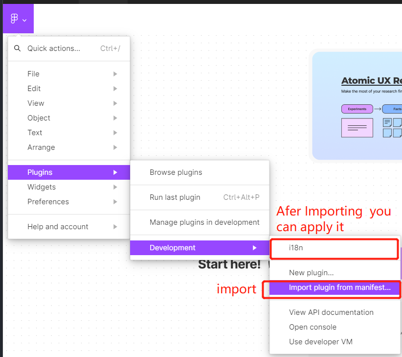
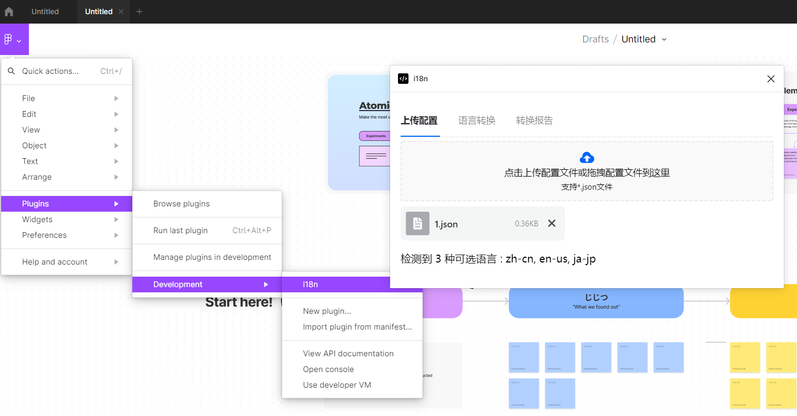
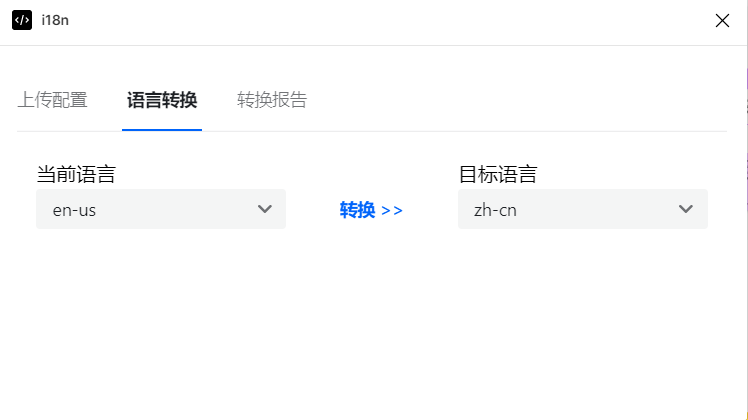
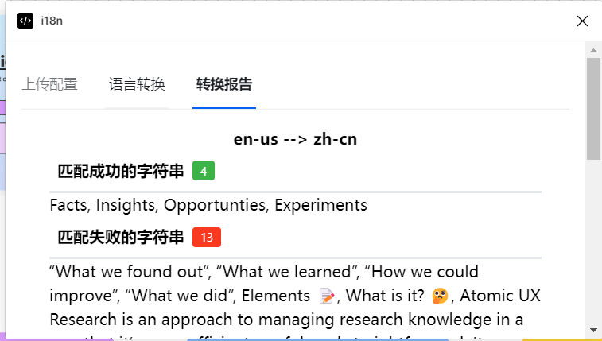
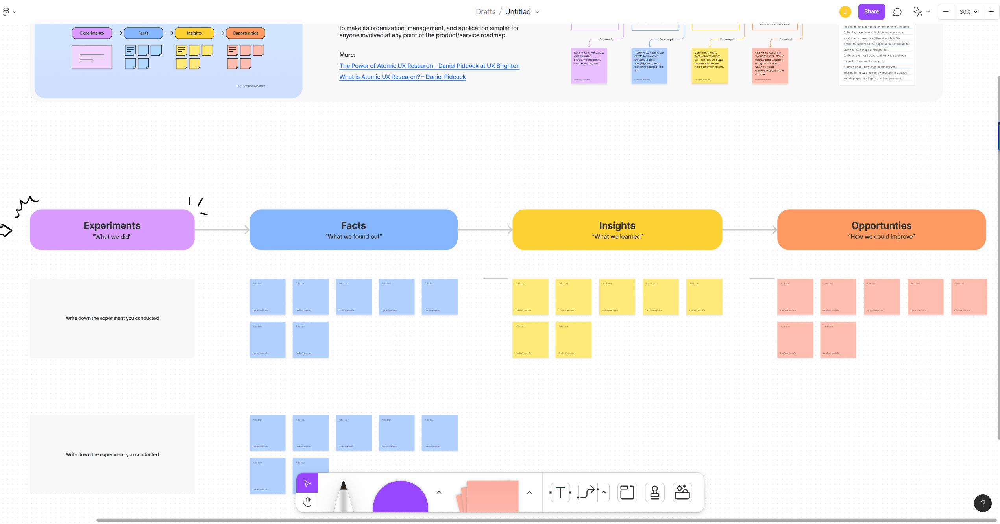

# Figma i18n Plugin
A [Figma](https://www.figma.com/) plugin for designers to preview the design draft for a multilingual environment. By the way, it also applies to [FigJam](https://www.figma.com/figjam/).

## How to build and apply
You need to build the code runs on the main thread in a sandbox, and the code for UI via React.
### Build main thread code
```bash
cd figma && pnpm install && npm run build-vite
```
### Build UI
```bash
cd ui && pnpm install && npm run build-vite
```
### Apply
Download desktop app and import plugin. The imported file is in the root directory of the project, named `manifest.json`.


## How to use it

### Step 1 Upload config file
The config file must be in JSON format as following.
```json
{
  "zh-cn": {
    "id-1": "实验",
    "id-2": "事实",
    "id-3": "洞察力",
    "id-4": "机遇"
  },
  "en-us": {
    "id-1": "Experiments",
    "id-2": "Facts",
    "id-3": "Insights",
    "id-4": "Opportunties"
  },
  "ja-jp": {
    "id-1": "じっけん",
    "id-2": "じじつ",
    "id-3": "どーさつ",
    "id-4": "つくえ"
  }
}

```

This is a nested object with the first layer of the optional language and the second layer of the translation result of the string ID binding. 


### Step 2 Translate
Select the original language and dest language, and translate the words.


### Step 3 Checkout report
Now, you can checkout the report via report.


## Example
I prefer to use FigJam for the example, but this also applies to Figma.


## Related articles